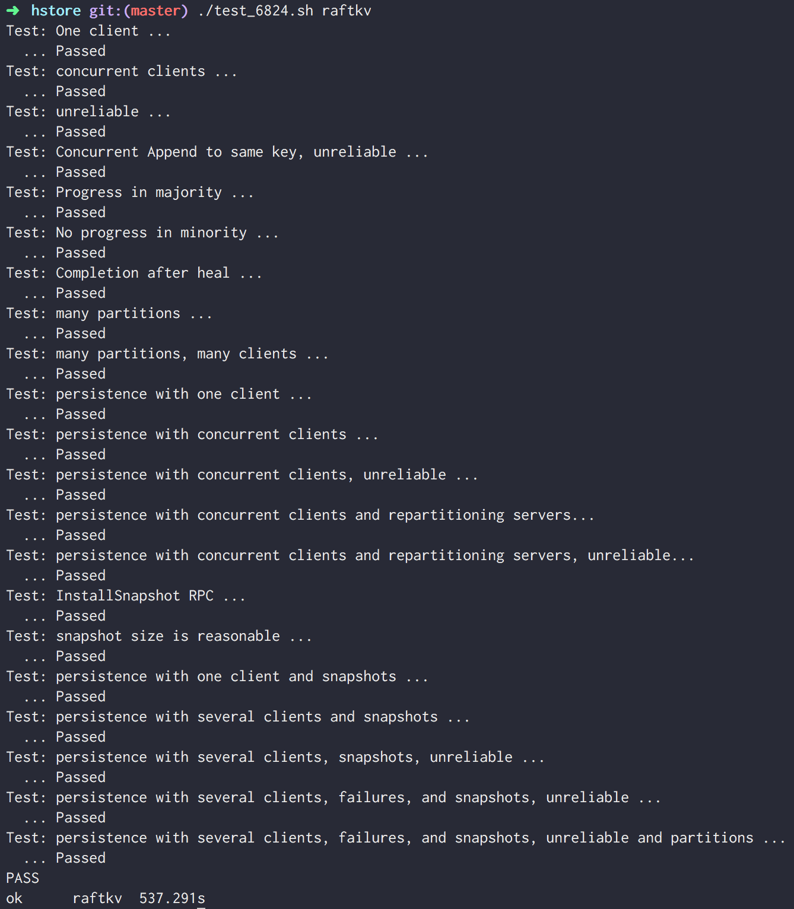
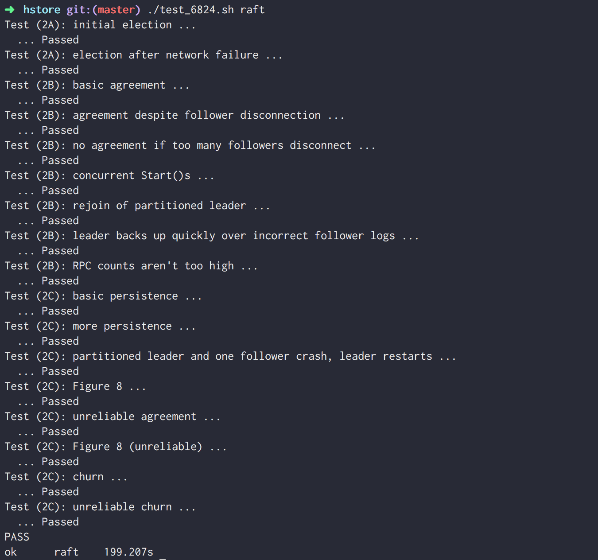

# hstore

[](https://goreportcard.com/report/github.com/hoanhan101/hstore)

**hstore** is a fault-tolerant distributed key-value store inspired by
[MIT's 6.824: Distributed System Spring 2017 Lab](http://nil.csail.mit.edu/6.824/2017/).
The goal of the project is to build a simple, fast and reliable database on top
of Raft, a replicated state machine protocol.

## Project Status

It is still a work in progress. Here is the initial project's [proposal](PROPOSAL.md).
Other parts will be updated as soon as it is live and ready.

### Tasks

- [x] Implement Raft Consensus Algorithm
  - [x] Pass all lab tests
  - [x] Adapt a clear and understandable structure
  - [x] Follow the paper closely and comment heavily on the code
- [x] Implement Fault-tolerant Key-Value Service
  - [x] Pass all lab tests
- [x] Build a simple client's stdin
  - [x] Be able to specify number of servers to boot up
  - [x] Implement GET, PUT, APPEND
- [x] Add Go report card
  - [x] Clean up code and fix Golint, aim to have A+

### Ideas

- [ ] Enable network I/O so every server in the quorum have a public host and port, instead of just
  communicating though Go routines
  - Details:
    - net/prc doesn't have a Network object so cannot add/remove server
    - labrpc doesn't have option for network I/O (e.g.: Client.Dial and Server.ServeConn)
  - Proposed solutions (either one of these):
    - [ ] Adapt laprpc to net/rpc, add more functions and rewrite the package to use websocket
    - [ ] Use net/rpc and adapt labrpc library's functionalities
    - [ ] Keep the labrpc code, wrap it with Go net.
- [ ] Be able to start a RaftKV server one by one and watch the leader election as well as
  log replication in real time (of course with key-value service)
- [ ] Implement RESTful APIs to query each server's kv store
- [ ] Implement logging
- [ ] Make sure things are configurable
- [ ] Build CLI for server and client (e.g.: [redis demo](http://try.redis.io/))
- [ ] Make Persister read/write Raft's snapshot on/to disk (instead of holding on memory)
- [ ] How to do service discovery? (e.g.: [consul demo](https://youtu.be/huvBEB3suoo))
- [ ] Dockerize + automate build
- [ ] Continuous Integration and Delivery
- [ ] Godoc 
- [ ] Code coverage 

### Issues

- [ ] raftkv tests fail on Docker Ubuntu
  - Details:
    - All tests pass on Mac, but not on Docker on Mac
    - Mac OS Sierra 10.12.6, Docker version 17.06.1-ce, build 874a737, golang 1.10.1
    - Either something wrong with networking inside container or the labrpc package
  - Proposed solutions:
    - [ ] Test on real Ubuntu machine and go from there

## Table of Contents

- [Getting Started](#getting-started)
  - [Installing](#installing)
  - [Running](#running)
  - [Testing](#testing)
  - [Example](#example)
- [MIT's 6.824](#mits-6824)
  - [raftkv](#raftkv)
  - [raft](#raft)
  - [mapreduce](#mapreduce)
  - [word-count](#word-count)
- [References](#references)

## Getting Started

### Installing

```
git clone https://github.com/hoanhan101/hstore.git && cd hstore
```

### Running

> TODO

### Testing

> Refer to MIT's 6.824 raftkv test below

### Example

> TODO

## MIT's 6.824

Assume that user set the `GOPATH` correctly, one can follow these instructions 
to run tests for different programs. If not, here is
[an example](https://github.com/hoanhan101/go-playground) on how to do it.

### [raftkv](src/raftkv)

**raftkv** is a fault-tolerant key-value storage service built on top of Raft. It is a replicated
state machine, consisting of several key-value servers that coordinate their activities through
the Raft log. It should continue to process client requests as long as a majority of the servers
are alive and can communicate, in spite of other failures or network partitions.

One can test the program by running:
```
$ ./test_6824.sh raftkv
```

In order to execute a specific test in a package:
```
$ ./test_6824.sh raftkv TestConcurrent
```

> More informations about the test script can be found at [test_6824](test_6824.sh).

Here is an example of test's output:



### [raft](src/raft)

**raft** is a replicated state machine protocol. It achieves fault tolerance by storing copies of
its data on multiple replica servers. Replication allows the service to continue operating even if
some of its servers experience failures.

One can test the program by running:
```
$ ./test_6824.sh raft 
```

This will run all the test for Raft. If one want to test features separately, then inside raft
pacakge directory:
- `go test -run 2A` checks leader election and heartbeats
- `go test -run 2B` checks log replication
- `go test -run 2C` checks persistent state

One can also check how much real time and CPU time with the `time` command:
```
time go test
```

Here is an example of test's output:



### [mapreduce](src/mapreduce)

By MapReduce's white paper:
> MapReduce is a programming model and an associated implementation for processing and generating 
> large data sets. Users specify a map function that processes a key/value pair to generate a set
> of intermediate key/value pairs, and a reduce function that merges all intermediate values 
> associated with the same intermediate key.

One can test the program by running:
```
$ ./test_6824.sh mapreduce
```

### [word-count](src/main/wc.go)

**word count** is a simple MapReduce example. It reports the number of occurrences of each word 
in its input.

One can test the program by running:
```
$ cd hstore
$ export "GOPATH=$PWD"
$ cd "$GOPATH/src/main"
$ ./test-wc.sh
```

This will do the test and clean up all intermediate files afterward.

## References

- [6.824: Distributed Systems Spring 2017](http://nil.csail.mit.edu/6.824/2017/)
- [ZiyueHuang's raft implementation](https://github.com/ZiyueHuang/Distributed-Systems)
